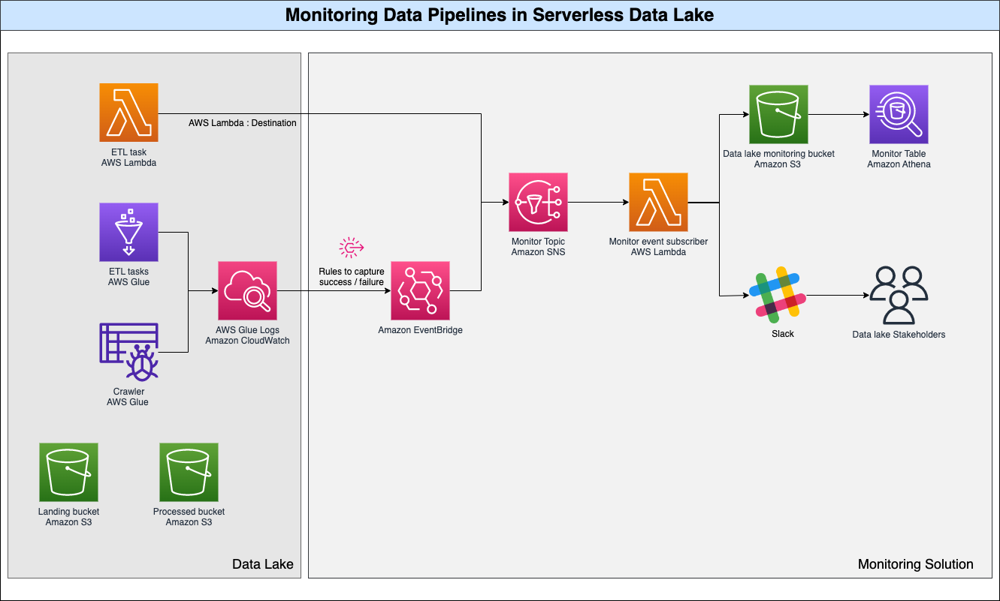
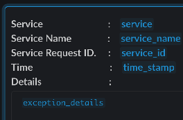
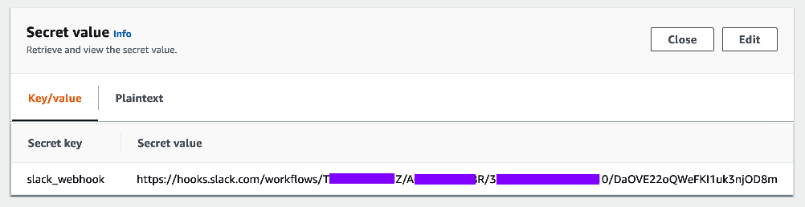

# Monitor ETL Jobs in Serverless Data Lake

## Overview
This repository serves as a launch pad for monitoring serverless data lakes in AWS. The objective is to provide a plug and play mechanism for monitoring enterprise scale data lakes. Data lakes starts small and rapidly explodes with adoption. With growing adoption, the data pipelines also grows in number and complexity. It is pivotal to ensure that the data pipeline executes as per SLA and failures be mitigated. 

The solution provides mechanisms for the following:

1. Capture state changes across all tasks in the data lake
   
2. Quickly notify operations of failures as they happen
   
3. Measure service reliability across data lake – to identify opportunities for performance optimization 

## Architecture

The solution highlighted in Orange box, illustrates with serverless services like AWS Lambda & AWS Glue ( These are not included). The design can be easily extended to other services like AWS Fargate.

The solution has the following components,
1. Storage : Amazon S3 
   To keeping the storage simple this data is stored in S3 and the following S3 Bucket is created:

   - `monitor` bucket :  to host  `monitor` database 

2. Monitoring:

   The monitoring stack has the following components:

   - `Amazon EventBridge Rules` : Capture success & failures in data pipeline
   - `Amazon SNS`: The messages are published to this SNS topic
   - `Monitor Database`: To store the overall states of the data pipeline
   - `Slack Webhooks`: Slack is used as messenger to notify important events to stakeholders. Slack webhooks are set up as described in [here](https://slack.com/help/articles/360053571454-Set-up-a-workflow-in-Slack)
     
     - Refer to the below template for the structure of the notification message
     
     
     - The slack webhook has to be updated to the AWS Secretes `datalake-monitoring` as shown below,
     
     
   - `Monitoring Lambda`: `datalake-monitoring-lambda` acts on the messages from SNS in the following ways,
      - Persists state of the data pipeline execution
      - Notifies stakeholders via IM on failure

3. Prerequisites 
    - All Lambda functions (functioning as data pipeline) should be configured with SNS topic as destinations 

## Deployment
The Cloud Deployment Kit(CDK) has been provided to deploy the solution. Follow the below steps,
1. Using Python 3.8,
    - `cd <path to pyproject.toml>`
    - `poetry install`
2. Stack deployment :
    - Update `ACCOUNT` & `REGION` in `./cdk/config.py` 
    - `cd cdk`
    - `cdk deploy --all  --profile <profile_name>`

### Dependency
Copy data files using the below command,
- `aws s3 cp --recursive s3://awsglue-datasets/examples/us-legislators s3://<ACCCOUNT>-<REGION>-landing/legislators --profile <profile_name>`
Replace ACCOUNT & REGION with the AWS Account number and AWS Region where the deployment must take place.

## Cleaning up
Remember to destroy the stacks if it is not to be used. 
    - `cdk destroy --all  --profile <profile_name>`
